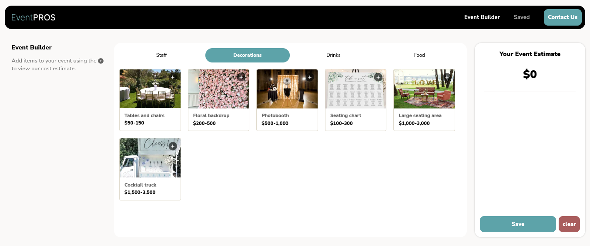

[](https://ramoun.me)


# Swenson He

> A sample screen from the Event Building Inc. web application that allows the user to select the task they want. All tasks are categorized under different categories like (Staff, Food, Catering ..etc). As such, the user selects a category and should be able to see all the items under this category. Each item in the category may be included in multiple categories, and other items will only be included in one category.

## A Screenshot of the Homepage



## Collective Screenshots of the Mobile Version

<p align="center" justify="center">
  
  
  
  
</p>

## A Demo for the App

- [Demo](https://swensonhe.omarramoun.com/)

## Built With

- Framework: _**Next.js, Redux, CSS-Modules, Framer Motion**_

## How to run Locally

```sh
$ git clone https://github.com/OmarRamoun/swenson-he.git

$ yarn install

$ yarn dev
```

## Author

👤 **Omar Ramoun**

- **GitHub**: [](https://github.com/omarramoun)
- **Twitter**: [](https://twitter.com/omarramoun)
- **LinkdIn**: [](https://www.linkedin.com/in/omarramoun/)

## 🤝 Contributing

Contributions, issues, and feature requests are welcome!

Feel free to check the [issues page](../../issues).

## Show your support

Give a ⭐️ if you like this project!

## Acknowledgments

- The team behind Synergey Of Serra (Great Guys)
- My Passion For Programming
